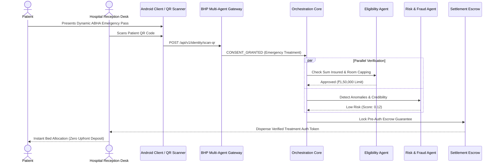

# Instant Cashless Emergency Admission Sequence

```mermaid
sequenceDiagram
    actor Patient
    actor HospitalDesk as Hospital Reception Desk
    participant App as Android Client / QR Scanner
    participant Backend as BHP Multi-Agent Gateway
    participant Orchestrator as Orchestration Core
    participant Eligibility as Eligibility Agent
    participant Risk as Risk & Fraud Agent
    participant Settlement as Settlement Escrow

    Patient->>App: Presents Dynamic ABHA Emergency Pass
    HospitalDesk->>App: Scans Patient QR Code
    App->>Backend: POST /api/v1/identity/scan-qr
    Backend->>Orchestrator: CONSENT_GRANTED (Emergency Treatment)
    
    par Parallel Verification
        Orchestrator->>Eligibility: Check Sum Insured & Room Capping
        Eligibility-->>Orchestrator: Approved (₹1,50,000 Limit)
    and
        Orchestrator->>Risk: Detect Anomalies & Credibility
        Risk-->>Orchestrator: Low Risk (Score: 0.12)
    end
    
    Orchestrator->>Settlement: Lock Pre-Auth Escrow Guarantee
    Settlement-->>HospitalDesk: Dispense Verified Treatment Auth Token
    HospitalDesk-->>Patient: Instant Bed Allocation (Zero Upfront Deposit)
```
